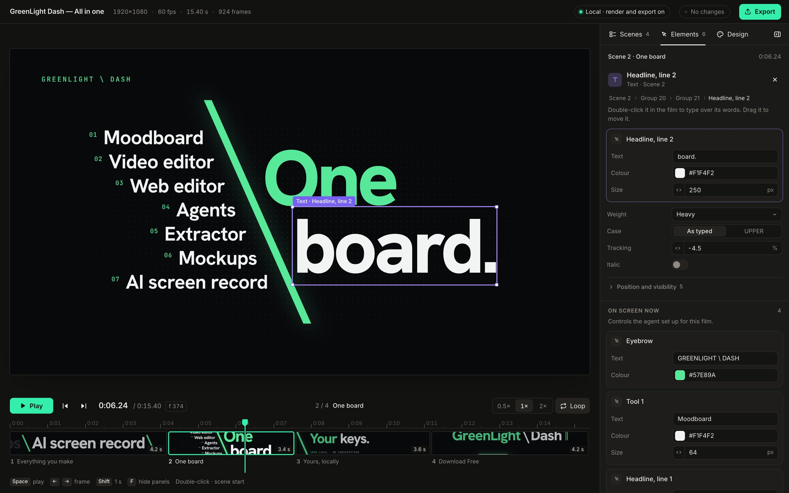

# GreenLight Motion

**An agentic motion engine and workflow.** Your agent designs a motion graphics film as plain web pages.
GreenLight Motion plays them on one frame-exact clock, lets you fine-tune every element in its Preview Engine, and
renders the film or carries it into GreenLight Dash's Video Editor (GLEA) and After Effects.

By [WPSoul](https://greenlightdash.pro), the makers of [GreenLight Dash](https://greenlightdash.pro). **GL Motion** for short.

**[Browse the motion gallery →](https://greenlightdash.pro/greenlight-motion-gallery/)**: all 275 library scenes, playing live.

## What makes it different

**Native HTML, with no special preparation.** Remotion scenes are React components that must take every value from
`useCurrentFrame()`. HyperFrames compositions need its `data-*` timing attributes and a paused GSAP timeline
registered on `window.__timelines`. A GreenLight Motion scene is any web page, written the way the web is written:
CSS animations and transitions, the Web Animations API, `requestAnimationFrame`, timers, SVG, canvas, WebGL and
three.js, video. The agent is free to use any library and every new browser feature. The page clock drives all of
it, so every frame is exact without the agent adapting its code for the renderer.

**Edit inside the Preview Engine before you render.** The preview plays the whole film, and you fine-tune any element
in any scene: click it to change its words, colour, size, weight, picture or position, drag it, or double-click
words to type over them. The film's colours and font change in one place. The agent reads your edits and keeps
working on the same film, and the render and every export include them.



**Reuse the film where you finish it.** Skills and a converter take the film further:

- **GLEA**, the GreenLight Dash Video Editor: every scene becomes an HTML clip that looks exactly like the preview,
  with the voice-over and sound effects on their own tracks.
- **After Effects**: a package of scene pages, reference stills and a prompt, for an agent that rebuilds the film as
  native comps, shape and text layers and keyframes (After Effects must be installed and open).

**Libraries to start from.** A **motion library** of 275 ready scenes in one clean interface style (buttons, forms,
cards, charts, dashboards, checkouts, countdowns, notifications, chats, AI prompts, carousels, titles), re-worded and
re-pictured with your copy. And a **prompt library** of Prompt Presets for whole films.

**The motion gallery.** Every library scene plays live in the [motion gallery](https://greenlightdash.pro/greenlight-motion-gallery/). Filter the scenes by
category or search them, switch them to dark or try another accent, and open any scene large to scrub through it,
see the words a film can change and the id an agent uses for it (`{ "item": "<id>" }`).

## Two ways to use it

- **As a skill.** Ask any agent that reads Agent Skills for a film: Claude Code, Codex, Gemini CLI, OpenCode. In
  quick mode it decides everything itself, builds the film and shows it in the preview, where you edit and approve
  the render.
- **As a workflow with the Preview Engine.** Fill the brief page (or pick a Prompt Preset), then approve each stage:
  the story and art direction, a storyboard with 2–3 directions and every line of copy, the preview you edit, then
  the render and exports. Inside GreenLight Dash the workflow runs as a pipeline on your board.

Along the way it records the **voice-over** in long, continuous takes (your recordings, a macOS draft voice, or
GreenLight Dash's text-to-speech models) and adds **sound effects** from the GreenLight Dash Sound Library or any
folder of sounds. The **render engine** records the pages frame by frame with motion blur, and writes MP4, WebM with
alpha and ProRes 4444, tagged BT.709.

## Prompt library

Ready prompts for a whole film, in `skills/greenlight-motion/lib/prompts.js`. The brief page and GreenLight Dash's
AI Motion Design offer them as **Prompt Presets** beside the field that describes your product. You can also paste one straight
into your agent. Fill in the `[bracketed parts]` first.

| Preset | What you get |
|---|---|
| **Motion design video** | A dynamic 15-second motion graphics film. The agent studies your product's pages and writes the content itself. |
| **Explainer video** | A launch-day product video with Dribbble-level UI motion: one morphing shape, driven by a cursor with real clicks and drags, reviewed scene by scene before it's done. |

## Install

**Claude Code.** This repository is both the plugin and its own marketplace:

```
/plugin marketplace add wpsoul/greenlight-motion
/plugin install greenlight-motion@greenlight-motion
```

To try a local copy without installing it: `git clone https://github.com/wpsoul/greenlight-motion`, then
`claude --plugin-dir greenlight-motion`.

**Any agent that reads Agent Skills.** Copy `skills/greenlight-motion` into the agent's skills folder
(Claude Code: `~/.claude/skills/greenlight-motion`), or tell the agent "use the skill at
`<path>/skills/greenlight-motion/SKILL.md`".

**GreenLight Dash** ships this skill. Open an agent terminal and choose **Presets ▸ GL Motion Film**,
or just ask the agent for a film.

## Requirements

**Inside GreenLight Dash you need nothing else.** The app captures websites, takes the review stills and
renders with its own browser and ffmpeg.

**On its own**, the skill uses:

| | What it's for | Get it |
|---|---|---|
| **Node.js 18+** | every tool (there's nothing to `npm install`) | [nodejs.org](https://nodejs.org/en/download) |
| **Python 3.9+ with Playwright** | website screenshots, review stills, rendering | [python.org](https://www.python.org/downloads/) · [Playwright for Python](https://playwright.dev/python/docs/intro) |
| **ffmpeg** (with ffprobe) | rendering, mixing the voice-over and sound effects, review sheets | [ffmpeg.org](https://ffmpeg.org/download.html) |

Without Python and ffmpeg the agent still writes the scenario and the storyboard's words, builds the preview
and makes the GLEA export. The website capture reads the page's text but takes no screenshots, the storyboard
and the After Effects package have no stills, and there's no rendered video.

**Check your machine:** `node skills/greenlight-motion/tools/doctor.mjs` lists what works and prints the
exact install commands for what's missing, with the right paths for your install. The agent runs it too.

### macOS

1. Install [Homebrew](https://brew.sh) if you don't have it.
2. `brew install node python ffmpeg`
3. Give the render engine its own Python with Playwright:
   ```
   python3 -m venv ~/.greenlight-motion/venv
   ~/.greenlight-motion/venv/bin/pip install -r skills/greenlight-motion/render/requirements.txt
   ~/.greenlight-motion/venv/bin/python -m playwright install chromium
   ```

### Windows (PowerShell)

1. Install the three with [winget](https://learn.microsoft.com/windows/package-manager/winget/), or with
   the installers from [nodejs.org](https://nodejs.org/en/download), [python.org](https://www.python.org/downloads/windows/)
   (tick "Add python.exe to PATH") and [gyan.dev](https://www.gyan.dev/ffmpeg/builds/) (add its `bin` folder to PATH):
   ```
   winget install OpenJS.NodeJS.LTS
   winget install Python.Python.3.12
   winget install Gyan.FFmpeg
   ```
2. Open a new terminal, then give the render engine its own Python with Playwright:
   ```
   py -m venv "$HOME\.greenlight-motion\venv"
   & "$HOME\.greenlight-motion\venv\Scripts\pip.exe" install -r skills\greenlight-motion\render\requirements.txt
   & "$HOME\.greenlight-motion\venv\Scripts\python.exe" -m playwright install chromium
   ```

### Linux (Debian, Ubuntu)

1. Node.js 18+ from [nodejs.org](https://nodejs.org/en/download) (older distributions ship an older one),
   then `sudo apt install python3 python3-venv ffmpeg`.
2. Give the render engine its own Python with Playwright:
   ```
   python3 -m venv ~/.greenlight-motion/venv
   ~/.greenlight-motion/venv/bin/pip install -r skills/greenlight-motion/render/requirements.txt
   ~/.greenlight-motion/venv/bin/python -m playwright install --with-deps chromium
   ```

The tools find `~/.greenlight-motion/venv` by themselves. Any other Python with Playwright works too: set
`GL_MOTION_PYTHON=/path/to/python`. An installed Chrome or Edge can stand in for `playwright install chromium`.

## Use

**Start from the brief page (optional).** Answer the questions on a visual page instead of in chat:
the product (or a Prompt Preset), the film, the look (brand-new or the library, with the whole library playing to
pick from), the motion and what to deliver.

```
node skills/greenlight-motion/tools/brief.mjs my-film
```

Open the URL it prints. The last button saves `my-film/brief.json` and copies a prompt with the paths to
the skill, the brief and the project. Paste it into Claude Code, Codex, Gemini or any agent that reads
skills. The agent asks only what the brief leaves open.

Or just ask for a film, for example: *"Make a 15-second promo for our spring sale. The code is SPRING50, it
ends May 3, and here are two product photos."* That is **quick mode**: the agent decides everything itself,
builds the film and shows it in the preview, where you edit anything and approve the render. It asks nothing
first unless it doesn't know what the film is about.

Say "step by step" (or pick it in the brief) for the **guided** way, where you approve each stage. The agent
follows `skills/greenlight-motion/SKILL.md`:

1. It asks questions, or reads your brief.
2. It writes the **scenario**: the story in words (a logline and the beats). For brand-new motion graphics
   it also writes the art direction: the concept, the look, the type and the motion language. You approve it.
3. It shows a **storyboard** with 2–3 directions: one still per shot, with every line of its copy and its
   part of the voice-over under it. You pick one and correct the words.
4. It builds the **preview**: the player page, with working Render and Export buttons when it runs locally.
   You click anything to change it, or change the film's colours and font, and approve it. The agent reads your
   changes (`tools/edits.mjs`) and renders with them.
5. It records the voice-over in long, continuous takes, and adds sound effects if you want them.
6. It renders and exports.

Inside GreenLight Dash the film becomes a **pipeline** on the current board. The steps run in a row, each
approval is a gate, and every card sits at full size in a review lane below. The agent renders and exports
after you approve the preview; the film lands in the pipeline's Final film, and exports become Video Editor
projects.

## Updating

Claude Code:

```
claude plugin marketplace update greenlight-motion
claude plugin update greenlight-motion@greenlight-motion
```

Restart Claude Code afterwards. If you copied the skill folder instead, copy the new version over it.

## What's inside

```
.claude-plugin/        plugin + marketplace manifests
docs/                  the README's pictures
skills/greenlight-motion/
  SKILL.md             the workflow the agent follows
  lib/                 the scene runtime (page clock, scene kit, edits, the preview's element picker, the player),
                       the motion library (its engine and 275 scenes, the HTML export), the prompt library
                       (prompts.js) and three.js (lib/vendor)
  registry.json        every library scene: words you can re-word, picture slots, length (built from lib/)
  tools/               brief page, site capture, storyboard, gallery, preview, local server, render, export,
                       your edits, voice-over, sound effects, checks, and doctor (what this machine can do)
  runtime/ templates/  the pages' shared code and markup
  render/              the render engine
  scripts/ae/          the safe After Effects script runner (for the After Effects package)
  references/          scene pages, scenario format, art direction, easing, board mode, exports, After Effects,
                       render, voice-over, sound
```

To add scenes to the library or release a new version, see [CONTRIBUTING.md](CONTRIBUTING.md).

## License

MIT © [WPSoul](https://greenlightdash.pro). The icons are Lucide paths (ISC). three.js is MIT
(`skills/greenlight-motion/lib/vendor/LICENSE-three.txt`). See [LICENSE](LICENSE).
